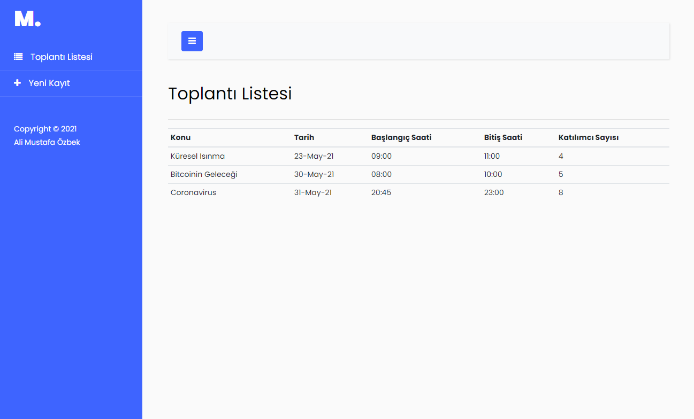
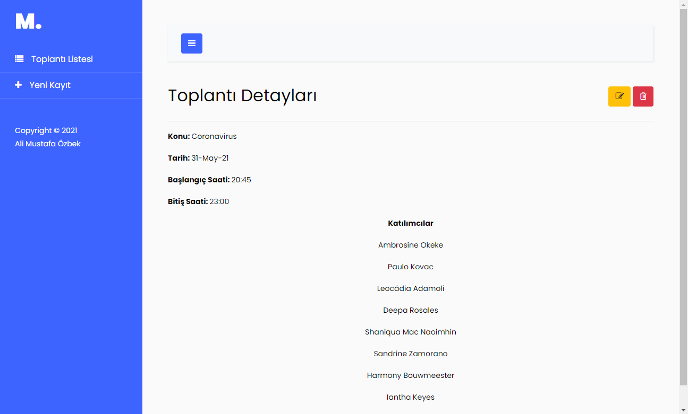

# MeetingOrganizerUI
HTML&CSS&JS Bootstrap ve JQuery ile geliştirildi.  
Müşteriler ile yapılacak toplantıların kaydedilebileceği, güncellenebileceği ve silinebileceği bir tek sayfa uygulaması.
  
## Giriş ekranı ve Toplantı Listesi
  
  
## Toplantı oluşturma ekranı  
    
  
## Toplantı detayları ekranı  
   
  
